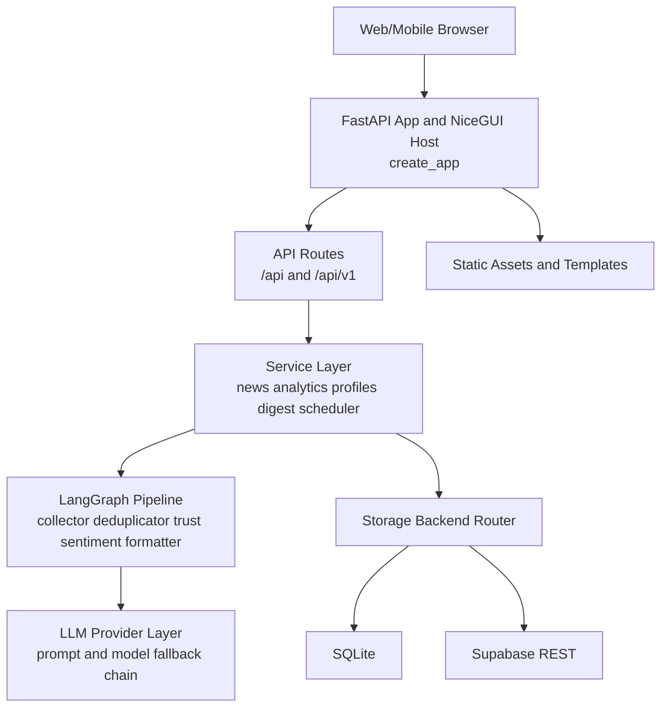
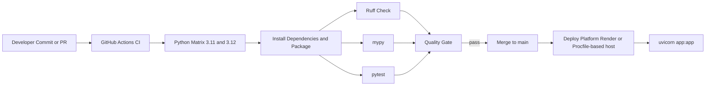

# Development Activity and Engineering Standards

This document describes how development work happens in this repository and how we maintain standard coding practices across implementation, testing, and delivery.

## 1. Development Lifecycle

1. Plan work from issue, bug report, or feature request.
2. Create a focused branch from `main`.
3. Implement changes in `src/dailyai` (or related module) with small, reviewable commits.
4. Add or update tests in `tests/` for behavior changes.
5. Run local quality gates before pushing.
6. Open a Pull Request to `main`.
7. Pass CI checks (lint + tests on Python matrix).
8. Merge and deploy using platform start configuration.

## 2. Standard Coding Practices

## Language and runtime
- Python version target: 3.11+.
- Async-first style for I/O paths (FastAPI handlers, storage adapters, service calls).
- Keep business logic inside service and graph modules, not in route handlers.

## Code style and formatting
- Formatter: Ruff format.
- Linter: Ruff checks.
- Type checking: mypy.
- Max line length: 100 (configured in `pyproject.toml`).

Use these commands locally:

```bash
uv run ruff format .
uv run ruff check .
uv run mypy .
```

## Architecture boundaries
- API layer: `src/dailyai/api`
- Domain/services layer: `src/dailyai/services`
- Pipeline layer: `src/dailyai/graph`
- Storage layer: `src/dailyai/storage`
- UI layer: `src/dailyai/ui`

## Configuration and secrets
- Do not hardcode secrets.
- Use environment variables (`.env` locally, platform env vars in deployment).
- Keep deployment and local behavior aligned with `requirements.txt` + runtime entrypoint.

## 3. Test Strategy and Test Cases

Current test suite location: `tests/`

Primary test files:
- `tests/test_agent.py`
- `tests/test_api_keys.py`
- `tests/test_comprehensive.py`
- `tests/test_function_health.py`
- `tests/test_onboarding.py`

Testing goals:
- Verify core feed and normalization behavior.
- Validate onboarding and profile-related interactions.
- Validate key utility and integration paths.
- Prevent regressions in production-critical flows.

Run all tests:

```bash
uv run pytest -q
```

Useful targeted runs:

```bash
uv run pytest -q tests/test_function_health.py
uv run pytest tests/ -v --tb=short
```

## 4. CI/CD Pipeline

CI workflow source: `.github/workflows/ci.yml`

Trigger conditions:
- Push to `main`
- Pull request to `main`

CI execution summary:
1. Checkout repository.
2. Run matrix on Python 3.11 and 3.12.
3. Install dependencies from `requirements.txt`.
4. Install package in editable mode: `pip install -e .`.
5. Install tooling: `pytest`, `pytest-asyncio`, `ruff`, `mypy`.
6. Run Ruff lint checks.
7. Run mypy type checks (non-blocking currently).
8. Run full pytest suite.

CD/deployment configuration:
- Procfile start command: `uvicorn app:app --host 0.0.0.0 --port $PORT`
- Render start command mirrors Procfile in `render.yaml`.
- Build command installs from `requirements.txt` for deployment parity.

## 5. Architecture Diagram



## 6. CI/CD Diagram



## 7. Definition of Done

A change is complete when:
1. Code follows module boundaries and formatting rules.
2. New/changed behavior includes tests.
3. `ruff format`, `ruff check`, and `pytest` pass locally.
4. CI passes on all configured Python versions.
5. Deployment configuration remains valid and startup is healthy.
