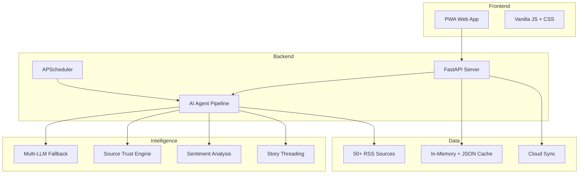

<div align="center">

# 🤖 DailyAI

### AI News Intelligence in 60 Seconds

[](https://github.com/shivangsinha/DailyAInews/actions)
[](LICENSE)
[](https://www.python.org/downloads/)
[](CONTRIBUTING.md)
[](https://www.dailyai.site)

**From AI headlines to action — curated, scored, and explained by AI agents.**

[Live Demo](https://www.dailyai.site) · [API Docs](https://www.dailyai.site/api/docs/guide) · [Report Bug](.github/ISSUE_TEMPLATE/bug_report.yml) · [Request Feature](.github/ISSUE_TEMPLATE/feature_request.yml)

</div>

---

## What is DailyAI?

DailyAI is an **AI-powered news intelligence platform** that curates the most important AI industry news, scores source trustworthiness, analyzes sentiment, and groups related stories into threads — so busy professionals can make informed decisions in 60 seconds.

**Not just another aggregator.** DailyAI tells you:
- 📰 **What happened** — AI-curated from 50+ sources hourly
- ✅ **How trustworthy** — Source trust scoring (Verified / Known / Unrated)
- 📈 **Market sentiment** — Bullish / Bearish / Neutral per story
- 🧵 **Story threads** — Related articles grouped by event
- 💡 **Why it matters** — One-sentence professional relevance
- 🎯 **What to do next** — Role-based action items

## Features

| Feature | Description |
|---|---|
| 🤖 **AI Curation** | Agentic pipeline with multi-LLM fallback (Gemini, NVIDIA, Groq, HuggingFace) |
| ✅ **Source Trust** | 3-tier trust scoring: Verified, Known, Unrated |
| 📈 **Sentiment** | Per-article market sentiment analysis |
| 🧵 **Story Threads** | Automatic grouping of related coverage |
| 🌍 **Multilingual** | English, German, Hindi with native translations |
| 🇩🇪 **Germany-first** | DACH sources (Heise, Golem, t3n, Handelsblatt), DSGVO compliant |
| 📱 **PWA** | Installable, works offline, no app store needed |
| 🔐 **Privacy-first** | No login, no tracking cookies, local-first storage |
| 📬 **Email Digest** | Daily AI brief delivered to your inbox |
| 🔌 **Developer API** | REST API with free/pro tiers for building on DailyAI data |
| 🎨 **Dark/Light** | Premium dark mode with light theme option |

## Quick Start

```bash
# Clone
git clone https://github.com/shivangsinha/DailyAInews.git
cd DailyAInews

# Setup
python -m venv venv && source venv/bin/activate
pip install -r requirements.txt
cp .env.example .env  # Add your API keys

# Run
python -m uvicorn app:app --reload --port 8000
```

Open [http://localhost:8000](http://localhost:8000) 🚀

## Environment Variables

| Variable | Required | Description |
|---|---|---|
| `GOOGLE_AI_KEY` | ✅ | Google Gemini API key (primary LLM) |
| `GROQ_API_KEY` | Optional | Groq API key (fallback LLM) |
| `NVIDIA_API_KEY` | Optional | NVIDIA API key (fallback LLM) |
| `LLM7AI_KEY` | Optional | llm7.io API key (OpenAI-compatible fallback LLM) |
| `LLM7_API_URL` | Optional | Override llm7 endpoint (default: `https://api.llm7.io/v1/chat/completions`) |
| `LLM7_MODEL` | Optional | llm7 model name override (default: `gpt-4o-mini`) |
| `HF_API_TOKEN` | Optional | HuggingFace API token |
| `BYTEZ_API_KEY` | Optional | Bytez API key |
| `RESEND_API_KEY` | Optional | Resend API key for email digest |
| `SUPABASE_URL` | Optional | Supabase URL for cloud sync |
| `SUPABASE_KEY` | Optional | Supabase anon key |

## Architecture



## Developer API

Get curated AI news data for your apps, bots, and workflows.

```bash
# Get a free API key
curl -X POST https://www.dailyai.site/api/v1/keys \
  -H "Content-Type: application/json" \
  -d '{"name": "My App", "email": "you@example.com"}'

# Fetch AI news
curl https://www.dailyai.site/api/v1/feed \
  -H "X-API-Key: dai_your_key_here"
```

| Tier | Price | Requests/Day | Features |
|---|---|---|---|
| **Free** | €0 | 100 | Basic fields, all topics |
| **Pro** | €7.99/mo | 10,000 | + sentiment, trust, threads |
| **Enterprise** | Custom | 50,000+ | + white-label, SLA |

📖 **[Full API Documentation →](https://www.dailyai.site/api/docs/guide)**

## Tech Stack

- **Backend**: Python 3.11+ · FastAPI · APScheduler · Pydantic
- **Frontend**: Vanilla JS · CSS3 · PWA
- **AI**: Gemini · NVIDIA DeepSeek · Groq · HuggingFace (multi-provider fallback)
- **Storage**: In-memory + JSON persistence · Supabase cloud sync
- **Email**: Resend API
- **CI**: GitHub Actions · Ruff · mypy · pytest

## Contributing

We welcome contributions! See [CONTRIBUTING.md](CONTRIBUTING.md) for setup instructions and guidelines.

```bash
# Run tests
pytest tests/ -v

# Lint
ruff check .
```

## Roadmap

| Feature | Status | FutureScope |
|---|---|---|
| Multi-LLM fallback pipeline | Done | Add provider health scoring and adaptive prompt shrinking for 413/429 handling. |
| Source trust scoring | Done | Expand source registry with region-specific confidence tuning. |
| Sentiment analysis | Done | Add confidence score and domain-aware sentiment calibration. |
| Story thread grouping | Done | Improve clustering across multilingual duplicates. |
| Developer API v1 | Done | Add API v2 with thread-centric and delta-feed endpoints. |
| German market compliance (Impressum, DSGVO) | Done | Add automated policy/version changelog in release notes. |
| CI pipeline | Done | Add browser E2E tests for card interactions and sheet behavior. |
| Related stories mini-cards (tap-to-open) | In Progress | Add semantic embeddings to guarantee 5 strong related cards even in sparse regional feeds. |
| Browser extension | Planned | Build read-later capture to DailyAI saved list. |
| Slack/Discord bot | Planned | Post digest + thread updates with topic subscriptions. |
| Custom alert rules | Planned | User-defined triggers by topic, sentiment, and source trust. |
| AI model comparison tracker | Planned | Track model releases with benchmark deltas over time. |
| Pro tier billing integration | Planned | Stripe-based usage metering and subscription lifecycle sync. |

## Legal

- 📄 [Impressum](https://www.dailyai.site/impressum) (German legal notice)
- 🔒 [Datenschutz](https://www.dailyai.site/datenschutz) (Privacy Policy / DSGVO)
- 📋 [Terms of Service](https://www.dailyai.site/terms)

## License

MIT License — see [LICENSE](LICENSE) for details.

The core platform is open-source. The Developer API monetization layer (`services/api_keys.py`) is operational but follows a separate commercial model.

---

<div align="center">

**Built with ❤️ for the AI community**

[⭐ Star this repo](https://github.com/shivangsinha/DailyAInews) if DailyAI helps you stay informed!

</div>
